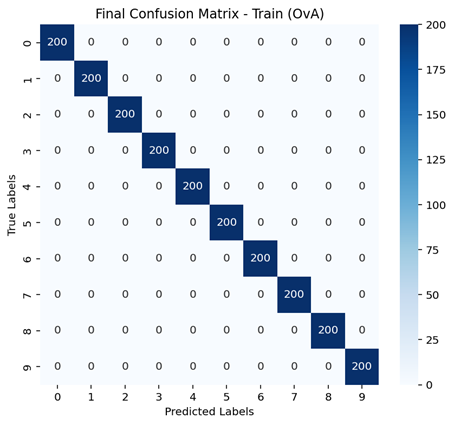
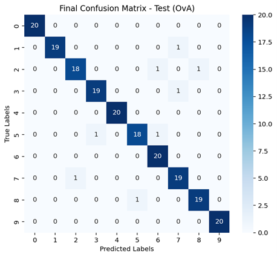

# Pocket Perceptron Classifier
This project implements a modular Perceptron Learning Algorithm with the Pocket Strategy for multi-class digit classification using Python. The model is evaluated on custom-designed features extracted from image data and supports both One-vs-All (OvA) and One-vs-One (OvO) classification strategies.

It includes:

- Custom feature extraction: Symmetry, intensity, and HOG-based features
- Multi-class classification: One-vs-One and One-vs-All strategies
- Pocket algorithm: Enhances standard perceptron for non-linearly separable data
- Evaluation metrics:
  - Overall Accuracy
  - Producer’s Accuracy (Recall)
  - User’s Accuracy (Precision)
  - Kappa Coefficient
- Visualization: Decision boundaries and confusion matrices

## Author
Serge Alhalbi

## Company
The Ohio State University

## Tools and Libraries
- Python

## Usage
```bash
git clone https://github.com/SergeAlhalbi/pocket-perceptron-classifier.git
cd pocket-perceptron-classifier
```

## Results
Below are the results:

## HOG Features – One-vs-All (OvA) Results

- **Training Confusion Matrix**  
  

- **Testing Confusion Matrix**  
  

- **Prediction Results**  
  

## HOG Features – One-vs-One (OvO) Results

- **Training Confusion Matrix**  
  

- **Testing Confusion Matrix**  
  

- **Prediction Results**  
  
  
